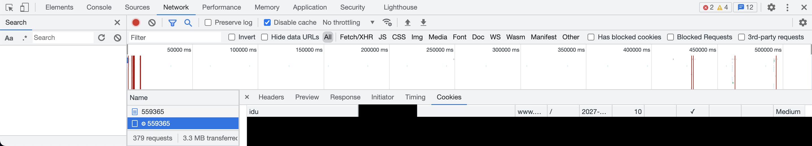

# windguru-date-cli
A tiny Pyhton script to scrape the windguru date UI for your user (via cookie-id)

## Prerequisite for using this script

1. Open your browser and navigate to [https://www.windguru.cz/](https://www.windguru.cz/)
2. Login to Windguru.cz via the bottom right login button e.g. via Google Single-Sign-On
3. Open one of the forecast pages in your browser e.g. [https://www.windguru.cz/43](https://www.windguru.cz/43)
4. Open your Developer Console to extract the `idu` from the cookie e.g. for Chrome in Mac ⌥ + ⌘ + J (see example image
   below for another spot)
   1. Go to the Network tab
   2. Reload the page
   3. Select the second entry in the list called like the number of your spot e.g. 43
   4. Go to the Cookies detail tab
   5. Search for `idu` and copy it 
6. Run the script as shown below with you `idu` as parameter


                       
## How to run this script
                         
The easiest way to run the script is via Docker (see also the provided [Dockerfile](Dockerfile))

### Build the Docker container
```bash
 docker build -t windguru-date-cli .
```

### Run the Docker container

You need to share a folder to generate the images.
```bash
  docker run -it -v $(pwd)/generated:/app/generated windguru-date-cli --idu <your-idu> \
    --spots "Tarifa" \
    --month-from 11 \
    --day-from 28 \
    --month-to 12 \
    --day-to 5 \
    --years 2018 \
    --years 2019 \
    --years 2020
```

## Options of this script

You can call the command with different parameters.

Use: pyhton app.py --help for a complete description.

As an example see:
```
python app.py --idu <your-idu> \
    --spots "Essaouira" \
    --month-from 11 \
    --day-from 28 \
    --month-to 12 \
    --day-to 5 \
    --years 2018 \
    --years 2019 \
    --years 2020
```

As a visual example:

